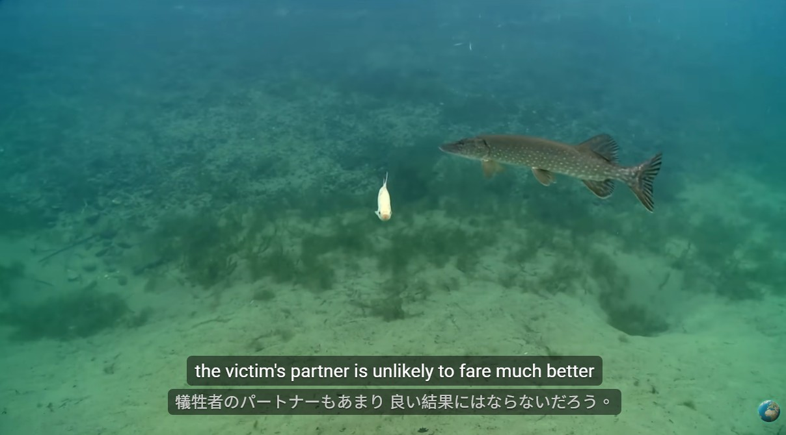
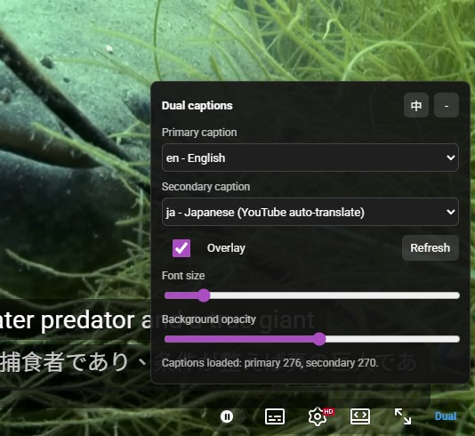

# Dual YouTube Caption Overlay

A Manifest V3 Chrome extension that displays two YouTube-provided caption tracks at the same time.

The extension reads YouTube official caption metadata, including auto-generated captions and YouTube auto-translate tracks. It does not use external translation APIs and does not scrape YouTube's native caption DOM.





## Features

- Select a primary and secondary caption track.
- Supports manual captions, auto-generated captions, and YouTube auto-translate.
- Displays both captions in a custom overlay that follows the video.
- Adds a `Dual` control inside the YouTube player UI when available.
- Stores user settings with `chrome.storage.local`.
- Adjustable font size and caption background opacity.
- Keyboard shortcut: `Alt+D` toggles the overlay.

## Install

1. Open `chrome://extensions`.
2. Enable `Developer mode`.
3. Click `Load unpacked`.
4. Select this project folder.
5. Open or refresh a YouTube video page.

After editing extension files, reload the extension from `chrome://extensions` and refresh the YouTube tab.

## Usage

1. Open a YouTube video with captions.
2. Move the mouse over the YouTube player controls.
3. Click the `Dual` button.
4. Choose the primary and secondary caption tracks.
5. Adjust font size or background opacity if needed.

If the `Dual` button cannot be inserted into YouTube's native controls, the extension shows a small floating fallback button near the video.

## Project Structure

```text
manifest.json
background.js
bridge.js
content.js
overlay.css
popup.html
popup.js
utils/
  captionParser.js
  timeSync.js
```

## Notes

- Captions are fetched only from YouTube caption endpoints.
- Some videos require YouTube's own timedtext request token. The extension may briefly prime YouTube captions internally so the official caption URL can be captured.
- Live streams and videos without available caption data may not show dual captions.
- YouTube changes its internal player behavior frequently, so reload the extension and refresh the page after updates.

## Known Issue: Auto-Generated to Traditional Chinese

When using YouTube auto-generated captions translated to Traditional Chinese, captions may appear later than Simplified Chinese, freeze for a while, or suddenly output many translated lines at once.

This is usually caused by YouTube's own auto-translate timing data, not by this extension. The translated text can arrive without stable per-line timestamps, with delayed chunking, or with extra Simplified-to-Traditional conversion latency. When the timing data is missing, delayed, or grouped into large chunks, the extension can only render the captions after YouTube provides usable timed caption data.

### Technical Background & Community Insights

While YouTube has never officially confirmed this behavior, insights from open-source developers (via reverse-engineering network requests) and NMT (Neural Machine Translation) experts suggest two main technical bottlenecks:

1. **Missing Timestamps in Network Requests:**
   Inspecting YouTube's backend data reveals that requests for Simplified Chinese (`zh-CN`) return precise, character-level timestamps. However, requests for Traditional Chinese (`zh-TW`) frequently lack millisecond-level alignment and suffer from significantly higher network latency. The data stream indicates that Traditional Chinese undergoes an extra layer of asynchronous processing, breaking the sync.

2. **Two-Step Translation Latency (Pivot Language):**
   In large-scale translation models, Simplified Chinese acts as a high-priority "pivot language" due to its massive dataset. To optimize server costs, platforms often translate source text into the pivot language first, then convert it to the target variant (Simplified $\rightarrow$ Traditional). This extra conversion step, combined with context re-evaluation, causes severe chunking delays.

_Note: This explanation is based on community data analysis and reverse engineering, as YouTube's underlying algorithms remain a closed black box._
